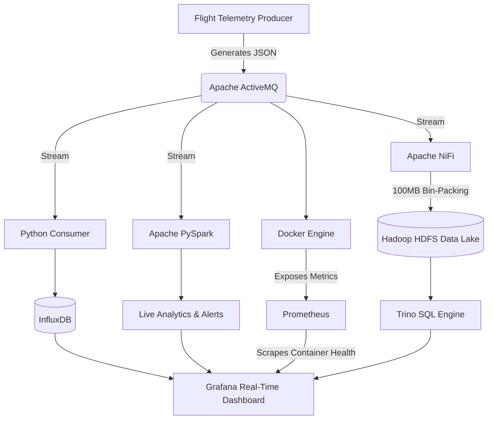

# ✈️ Flight Telemetry Data Architecture

## 1. Project Overview

This repository implements a multi-tiered Data Engineering architecture designed to process high-velocity flight telemetry. By routing message streams through specialized channels, the system bridges the gap between low-latency real-time tracking and distributed enterprise storage, ensuring optimal performance for varying analytical needs.

---

## 2. Architecture Flowchart



---

## 3. Pipeline Breakdown

### 3.1 Summary Matrix

| S.No. | Pipeline Name | Target Stack / Tools | Operational Focus & Output |
|---|---|---|---|
| 3.1 | Real-Time Time-Series | InfluxDB & Grafana | Telemetry routing for instantaneous visualization and tracking via Grafana |
| 3.2 | Micro-Batch Analytics | Apache PySpark | Live data aggregation, fault detection, and threshold alerting |
| 3.3 | System Monitoring | Prometheus | Infrastructure health and container performance metrics scraping |
| 3.4 | Big Data Lakehouse | Apache NiFi, HDFS, Trino | Stream compression into 100MB HDFS blocks for historical Trino SQL querying |

### 3.2 Detailed Breakdown

#### ⏱️ Pipeline 1 — Real-Time Time-Series
- **Central Message Broker:** Apache ActiveMQ
- **Database Target:** InfluxDB
- **Visualization Engine:** Grafana
- **Description:** Routes telemetry to InfluxDB for instantaneous visualization and tracking via Grafana.

#### ⚡ Pipeline 2 — Micro-Batch Analytics
- **Central Message Broker:** Apache ActiveMQ
- **Analytics Engine:** Apache PySpark
- **Description:** Employs Apache PySpark for live data aggregation, fault detection, and threshold alerting.

#### 📊 Pipeline 3 — System Monitoring
- **Target Engine:** Docker Infrastructure
- **Monitoring Engine:** Prometheus
- **Description:** Uses Prometheus to scrape infrastructure health and container performance metrics.

#### 🗄️ Pipeline 4 — Big Data Lakehouse
- **Central Message Broker:** Apache ActiveMQ
- **Ingestion Flow:** Apache NiFi
- **Storage & Query Layer:** HDFS (100MB compressed blocks) & Trino SQL
- **Description:** Compresses high-speed streams into 100MB HDFS blocks via Apache NiFi, which are then mapped for historical Trino SQL querying.

---

## 4. Execution: Individual Pipelines

To respect standard hardware memory limits, clear your Docker engine first before running a pipeline in isolation.

### 4.1 Prerequisites

Run this command in your terminal before initiating any single pipeline:

```bash
docker rm -f $(docker ps -a -q)
```

### 4.2 Individual Pipeline Execution Steps

**Pipelines 1 & 3 — Time-Series & Monitoring**

| Step | Command / Action | Location / Details |
|---|---|---|
| 1 | `docker compose -f docker-compose.yml up -d influxdb grafana activemq prometheus` | Boot infrastructure services |
| 2 | `python producer.py` | Start telemetry data stream |
| 3 | `python influx_consumer.py` | Start database consumer |
| 4 | Open `http://localhost:3001` | View live dashboards in browser |

**Pipeline 2 — Spark Analytics**

| Step | Command / Action | Location / Details |
|---|---|---|
| 1 | `docker compose -f docker-compose.yml up -d activemq` | Boot ActiveMQ broker |
| 2 | `python producer.py` | Start telemetry data stream |
| 3 | `python spark_processor.py` | Start analytics engine |

**Pipeline 4 — Big Data Lakehouse**

| Step | Command / Action | Location / Details |
|---|---|---|
| 1 | `docker compose -f docker-compose-lakehouse.yml up -d` | Boot Lakehouse architecture |
| 2 | `python producer.py` | Start telemetry data stream |
| 3 | Open `https://localhost:8443/nifi` | Build drag-and-drop flow in Apache NiFi |
| 4 | `docker exec -it <trino_container_name> trino` | Map SQL schema |

---

## 5. Execution: Combined System

If deploying on a high-performance workstation, you can run the entire architecture simultaneously to watch data route through all four pipelines at once.

**Boot Primary Stack:**

```bash
docker compose -f docker-compose.yml up -d
```

**Boot Lakehouse Stack:**

```bash
docker compose -f docker-compose-lakehouse.yml up -d
```

**Start Python Pipeline Services (in order):**

1. **Start Producer Stream:** `python producer.py`
2. **Start Database Ingestion:** `python influx_consumer.py`
3. **Start Spark Analytics Processor:** `python spark_processor.py`

---

## 6. Legal

**Copyright:** Copyright (c) 2026 Ram Sudan. All Rights Reserved.

**License Type:** Strictly Proprietary.

**Terms:** This project and its source code are strictly proprietary. No part of this software may be copied, reproduced, or distributed without prior written permission.
